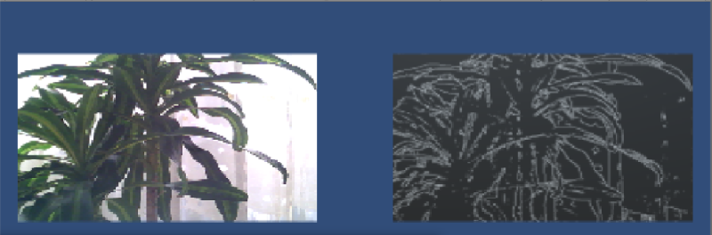

OpenCVSharp 3 in Unity Example
===
Author: [ShineLancer]

## OpenCVSharp 3
Wrapper for OpenCV on .NET framework

See [OpenCVSharp3](https://github.com/shimat/opencvsharp)

OpenCVSharp version should be identical to OpenCV version.

## Unity3D Canny Edge Display
* Conversion between OpenCVSharp image format (_Mat_) to Unity3D image holder (*Texture2D*). The conversion is paralleled, inspired by another [example](https://sourceforge.net/projects/unityopencvsharpcamshift/)
* Currently supports windows x86, x64 standalone and Unity editor.

## Capture

